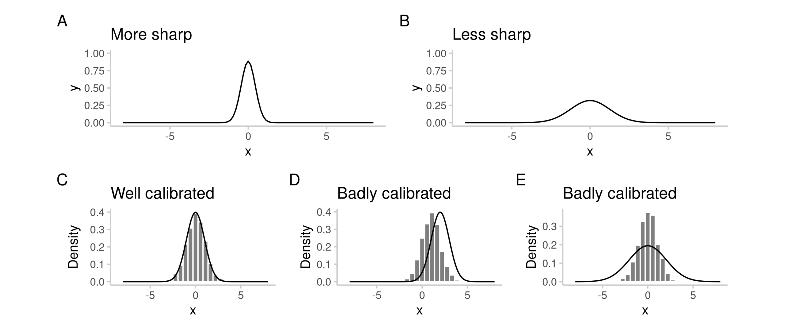

```{r setup, include=FALSE}
knitr::opts_chunk$set(echo = TRUE)
```

------------------------------------------------------------------------

# Evaluating forecasts with scoringutils

## Motivation

-   improve models

-   rank and select models for future forecasts

------------------------------------------------------------------------

## Different kinds of forecasts

-   point forecasts vs. probabilsitic forecasts
-   different foreast targets (e.g. binary or continuous)
-   different ways to stpre forecasts, e.g.
    -   predictive samples
    -   quantiles

------------------------------------------------------------------------

## What is a good forecast?

**Ideal forecast**: predictive distribution $F$ equals data-generating distribution $G$.

**Forecasting paradigm**: Maximise sharpness subject to calibration



------------------------------------------------------------------------

## Evaluation - two approaches

### 1) Looking at different aspects of sharpness and calibration separately

$\rightarrow$ learn about models

### 2) Summarise sharpness and calibration in a single number

$\rightarrow$ proper scoring rules $\rightarrow$ rank models

Proper scoring rule: best score in expectation if $F = G$

------------------------------------------------------------------------

## Scoringutils

-   paper: <https://arxiv.org/pdf/2205.07090.pdf>

-   R package: CRAN / [github.com/epiforecasts/scoringutils](https://github.com/epiforecasts/scoringutils) / [epiforecasts.io/scoringutils/](https://epiforecasts.io/scoringutils/)

-   Vignettes with detailed descriptions of all scores

-   Example data

------------------------------------------------------------------------

## Why scoringutils?

-   there are already packages which implement scoring metrics, most notably [scoringRules](https://arxiv.org/abs/1709.04743)

-   scoringutils

    -   focuses on *comparing* models

    -   handles missing data

    -   lots of visualisations

    -   convenient data.frame format

    -   easy to use, even as a non-expert

------------------------------------------------------------------------

## Illustration - example data from the European COVID-19 Forecast Hub

```{r}
library(scoringutils)
library(ggplot2)
```

```{r}
example_quantile
```

### Score forecasts

```{r}
scores <- score(example_quantile)
```

And summarise

```{r}
scores <- score(example_quantile)

summarised_scores <- scores |>
  summarise_scores(
    by = c("model", "target_type")
  ) |>
  # round output to two significant digits
  summarise_scores(
    fun = signif, 
    digits = 2
  ) 

summarised_scores |>
  plot_score_table(
    y = "model", 
    # colour shading per target_type
    by = "target_type"
  ) +
  facet_wrap(~ target_type)
```

------------------------------------------------------------------------

### Check forecasts are in the correct format

```{r}
check_forecasts(example_quantile)
```

### Check number of available forecasts + missing values

```{r}
avail_forecasts(
  data = example_quantile,
  by = c("model", "target_type")
)

```

```{r}
avail_forecasts(
  data = example_quantile,
  by = c("model", "target_type", "forecast_date") 
) |>
  plot_avail_forecasts(
    x = "forecast_date",
    show_numbers = FALSE
  ) +
  facet_wrap(~ target_type) +
  labs(y = "Model", x = "Forecast date")

```

### Visualising forecasts

```{r}
example_quantile |>
  # remove some of the data from the plot
  make_na(
    what = "truth",
    target_end_date > "2021-07-15",
    target_end_date <= "2021-05-22"
  ) |>
  make_na(
    what = "forecast",
    model != "EuroCOVIDhub-ensemble",
    forecast_date != "2021-06-28"
  ) |>
  plot_predictions(
    x = "target_end_date", 
    by = c("target_type", "location")
  ) +
  # additional formatting
  aes(colour = model, fill = model) +
  facet_wrap(
    target_type ~ location, 
    ncol = 4, 
    scales = "free_y"
  ) +
  labs(x = "Target end date")
```

### Scoring forecasts with `score()`

$\rightarrow$ one score per forecast

```{r}
score(example_quantile)
```

### Summarising scores

$\rightarrow$ apply arbitrary summary functions. Careful: you should usually only use the mean to preserve propriety of scores

```{r}
score(example_quantile) |>
  summarise_scores(by = c("model", "target_type"))
```

Creating a coloured table

```{r}
score(example_quantile) |>
  summarise_scores(
    by = c("model", "target_type")
  ) |>
  # round output to two significant digits
  summarise_scores(
    fun = signif, 
    digits = 2
  ) |>
  plot_score_table(
    y = "model", 
    by = "target_type" # calculate shading separately by "target_type"
  ) +
  facet_wrap(~ target_type)
```

### Pairwise comparisons

```{r}
pairwise <- score(example_quantile) |>
  pairwise_comparison(
    by = c("model", "target_type"),
    baseline = "EuroCOVIDhub-baseline"
  ) 
pairwise

library(dplyr)


score(example_quantile, metrics = "interval_score") |>
  summarise_scores(
    by = c("model", "target_type"),
    relative_skill = TRUE,
    baseline = "EuroCOVIDhub-baseline"
  ) |>
  arrange(target_type, scaled_rel_skill)


```

```{r}

pairwise <- score(example_quantile) |>
  pairwise_comparison(
    by = c("model", "target_type"),
    baseline = "EuroCOVIDhub-baseline"
  ) 

pairwise |>
  plot_pairwise_comparison() +
  facet_wrap(~ target_type)
```

### Score heatmaps

```{r}
score(example_continuous) |>
  summarise_scores(
    by = c("model", "location", "target_type")
  ) |>
  plot_heatmap(
    x = "location",
    metric = "bias"
  ) +
  facet_wrap(~ target_type)
```

### Visualising calibration

#### Decomposition of the weighted interval score

```{r}
score(example_quantile) |>
  summarise_scores(
    by = c("model", "target_type")
  ) |>
  plot_wis(
    relative_contributions = FALSE
  ) +
  facet_wrap(
    ~ target_type,
    scales = "free_x"
  )
```

#### PIT histograms

```{r}
example_continuous |>
  pit(
    by = c("model", "target_type")
  ) |>
  plot_pit() +
  facet_grid(
    target_type ~ model
  )
```

### Correlations between scores

```{r}
correlations <- example_quantile |>
  score() |>
  summarise_scores() |>
  correlation() 

plot_correlation(correlations)
```

```{r}

```
